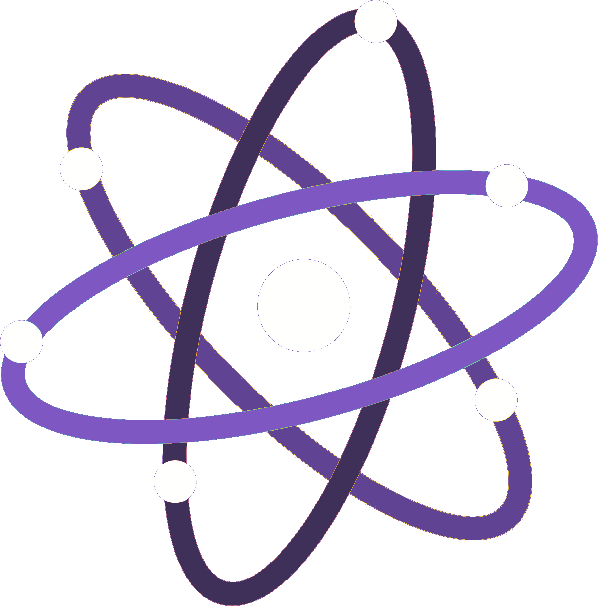

<p align="center">
  <a href="" rel="noopener">
 </a>
</p>

<h3 align="center">Quark lang</h3>

<div align="center">

[]()
[](https://github.com/NessMC/quark-lang/issues)
[](https://github.com/NessMC/quark-lang/pulls)
[](/LICENSE)

</div>

---

<p align="center"> 
    Quark is a self-transpiled programming language written in TypeScript.
    <br> 
</p>

## 📝 Table of Contents

- [About](#about)
- [Getting Started](#getting_started)
- [Manual installation](#manual)
- [Usage](#usage)
- [TODO](./TODO.md)
- [Contributing](./CONTRIBUTING.md)
- [Authors](#authors)

## 🧐 About <a name = "about"></a>

The main goal of Quark is to offer a language that combines simplicity and productivity in addition to its cool syntax.

## 🏁 Getting Started <a name = "getting_started"></a>

These instructions will get you a copy of the project up and running on your local machine for development and testing purposes. See [Manual installation](#manual) for notes on how to install the project on a live system.

### Prerequisites

To install Quark, you will need:

```
Node.JS > 13
NPM > 6
```

### Installing

---

## 🔧 Running the tests <a name = "tests"></a>

To run the tests:

```
npm run test
```

### Break down into end to end tests

No tests for the moment.

### And coding style tests

The linter is present in order to allow anyone to be able to contribute while being in the main coherence of the code.

```
npm run lint
```

## 🎈 Usage <a name="usage"></a>

No usage informations for the moment.

## 🚀 Manual installation <a name = "manual"></a>

To deploy Quark lang, do:

```bash
 $ git clone git@github.com:NessMC/quark-lang.git

 # OR

 $ git init
 $ git remote add origin git@github.com:NessMC/quark-lang.git
 $ git pull

 # OR

 $ docker pull nessmcfr/quark-lang
 $ docker run nessmcfr/quark-lang
```

## ✍️ Authors <a name = "authors"></a>

- [@NessMC](https://github.com/NessMC) - Idea & Initial work

See also the list of [contributors](https://github.com/NessMC/quark-lang/contributors) who participated in this project.

